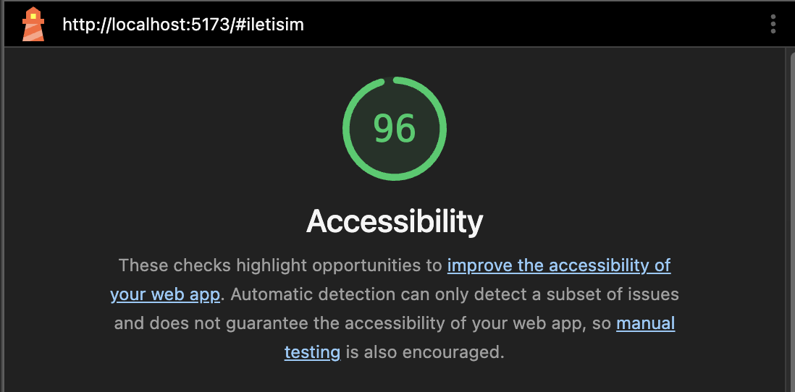

# Web Tasarımı ve Programlama LAB-1 & LAB-2

## Hakkında
Bu proje, Web Tasarımı ve Programlama dersi LAB-1 ve LAB-2 kapsamında Vite + React + TypeScript kullanılarak oluşturulmuştur.
Semantik HTML5 yapıları ve erişilebilirlik (a11y) standartlarına uygun olarak tasarlanmıştır.

## Geliştirici
- **Ad Soyad:** Ömer Bal
- **Öğrenci No:** 230541108

## Kullanılan Teknolojiler
- React 18
- TypeScript
- Vite
- Semantik HTML5 
- CSS
- Erişilebilirlik Standartları (a11y)

## Kurulum
```bash
npm install
```

## Çalıştırma
```bash
npm run dev
```
Tarayıcıda http://localhost:5173 adresini aç.

## Erişilebilirlik Test Sonucu (Lighthouse)

